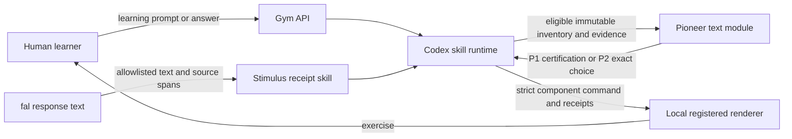

# Pioneer Gym architecture

This document is the authoritative product and runtime contract for the
hackathon build. Earlier grayscale frames are design artifacts only; their
authority labels are superseded by this document.

## Product contract

Pioneer Gym is an RL gym for humans. A learner types what they want to learn,
then practices a sequence of short decisions. The system optimizes the
learning curve: transferable learning gain per minute, not content volume or
answer completion.

- **The human learns.** Their choices and transfer attempts are the training
  signal.
- **Pioneer optimizes the curriculum.** P1 certifies that an exercise has a
  usable teaching signal. P2 selects exactly one next exercise from the
  eligible, immutable inventory.
- **Codex is the sole execution agent.** Every Codex action is governed by a
  checked-in `codex/skills/pioneer-gym*/SKILL.md`. Codex interprets the goal,
  binds Pioneer decisions to certified inventory, and emits the next UI
  command. Observable fixture responses are scored by an explicit fixed rubric,
  not an unreceipted model action. Codex may reject a Pioneer choice only when the
  choice is invalid, unsafe, or infeasible, and must make the rejection
  visible in a receipt.
- **The local UI boundary only verifies and renders.** It maps a validated
  component name and strict props to one allowlisted React component. It has no
  agent, provider connection, memory, or curriculum authority.
- **fal is the source of visual observations.** When an exercise depends on a
  generated visual, the only observations passed to Pioneer are allowlisted
  UTF-8 text and source spans from a verified fal receipt. Pioneer receives no
  image, URL, media, base64, or pixel claim.

## Runtime flow

The critical binding is one immutable pedagogical content hash. P1 validation,
P2 eligibility, the Codex command, and the renderer must all refer to the same
hash and schema version. A mismatch fails closed to a safe exercise rather
than being repaired or reinterpreted at render time.

## Turn budget and failure behavior

- Live Pioneer is a standalone, text-only module with one request, a four
  second deadline, no tools, and no retry.
- Live Codex runs only typed Pioneer Gym actions through the protected TeamBox
  adapter. Browser requests cannot submit a free-form Codex prompt, cwd, or
  app-server option.
- Provider calls are cancellable, capped per session, and guarded by bounded
  concurrency. Idempotency keys prevent duplicate work.
- Missing credentials, timeouts, malformed output, binding drift, or provider
  unavailability produce explicit `prevalidated`, `deterministic_skill_policy`,
  `deterministic_rubric_policy`, or `fallback` provenance. Fallback output never
  impersonates a live model decision.
- Sessions expire after 15 minutes and retained state is bounded.

## UI inventory

Only versioned components in `src/lib/contracts/gym-components.ts` are valid:

- `LearningPrompt`
- `CompareArena`
- `CreditAssignmentReplay`
- `TargetedRetryGym`
- `LayerOrderTransferGym`
- `SafeExerciseFallback`

Callbacks are injected locally by the Codex action provider. They are never
serialized into UI props.

## TeamBox boundary

Production runs the Next application and a narrow Codex action gateway as
separate services. The gateway is the only application process allowed to
reach the existing internal Codex app-server socket. It pins the repository
workspace, accepts only typed Pioneer Gym actions, and exposes no public TCP
listener. The web application reaches it through a private Unix socket.

The public application requires a signed, secure, HTTP-only access cookie.
Health is ready only when the application configuration, Pioneer configuration,
and protected TeamBox sockets required by live mode are available.

## Sample lesson

The gated `/lesson` route exposes one checked-in FAL-rendered MP4 through the
browser's native video player. It proves that the media output is viewable, but
it is not part of the Pioneer Gym control loop and does not claim that a learner
prompt generated a new video.
